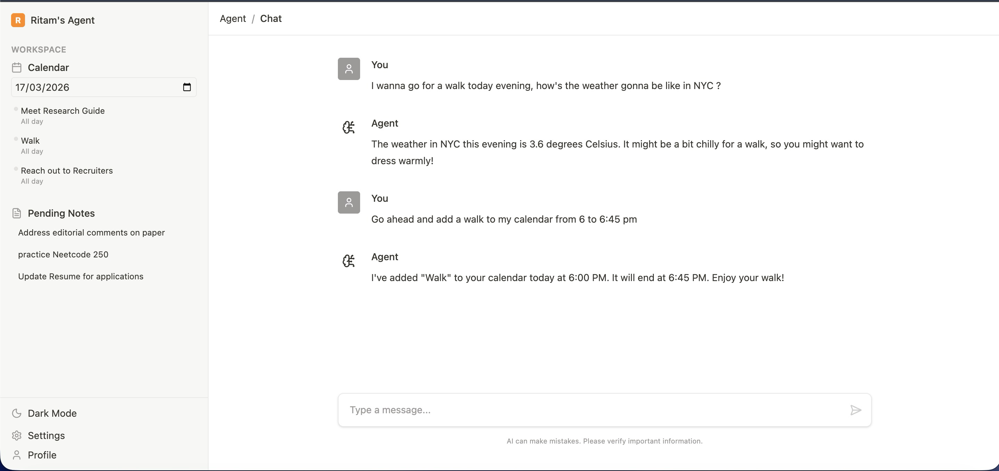
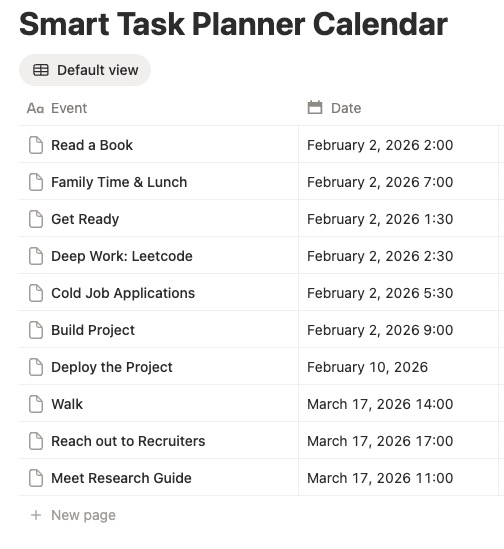
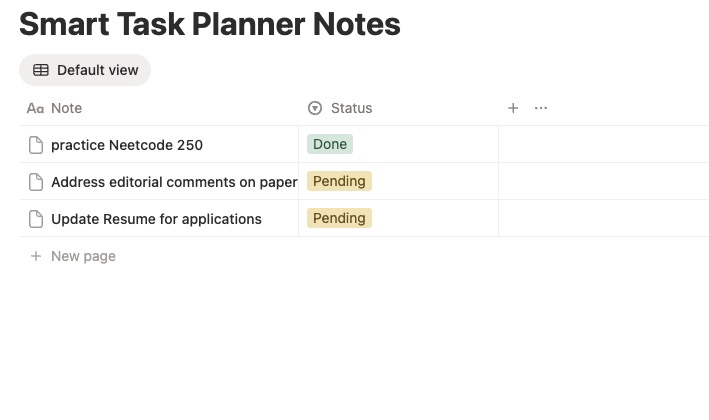
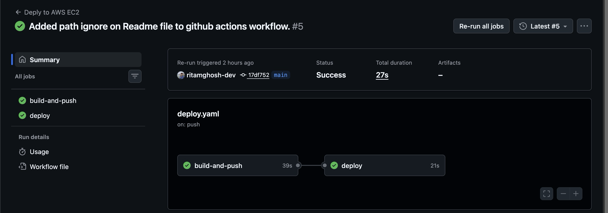

<h1 align="center">Notion ReAct Planner</h1>

<p align="center">
  
</p>

<p align="center">
  <em>A personal AI planning assistant that reasons, acts, and directly manages your Notion workspace.</em>
</p>

<p align="center">
  
  
  
  
  
  
  
  
  
  
  
  
  
</p>

<p align="center">
  <strong>Live demo available on request</strong>
</p>

---

## The Idea

I'm a heavy Notion user. My calendar and notes live there, and I rely on it to stay organised. But I kept running into the same friction: **Notion AI can only read and suggest — it can't actually do anything.** It can't add an event, check the weather before scheduling a walk, or cross-reference my notes with my calendar. To get that, Notion wants a subscription fee on top of an already paid plan.

So I built my own.

The **Notion ReAct Planner** is a personal AI assistant that goes beyond chat. Using the **ReAct (Reason + Act) paradigm**, the agent doesn't just answer questions — it *thinks* through what it needs to do, calls real tools to check context (weather, your live calendar, your pending notes), and then autonomously writes back to your Notion workspace. It's the AI planning layer I actually wanted — directly wired into my own data.

---

## Features

- **ReAct Reasoning Loop** — The agent reasons step-by-step before acting. Ask *"Schedule a walk tomorrow if it's not raining"* and it will check the weather first, then decide whether to add the event.
- **Live Notion Calendar Integration** — Read and write calendar events directly to your Notion database. The agent knows your existing schedule before suggesting new ones.
- **Notion Notes Management** — View and create notes in your Notion workspace with a `Pending` status, actionable from chat.
- **Real-time Weather Awareness** — Powered by [Open-Meteo](https://open-meteo.com/) (free, no API key needed). The agent checks conditions before recommending outdoor plans.
- **Context-Aware** — The system prompt is dynamically built with the current date and time, so the agent correctly understands *"tomorrow"*, *"this afternoon"*, or *"next Friday"*.

---

## Architecture

```
┌─────────────────────────────────────────────────────┐
│                   React Frontend                     │
│         (Chat Interface + Calendar + Notes)          │
└────────────────────────┬────────────────────────────┘
                         │ HTTP (same origin)
                         ▼
┌─────────────────────────────────────────────────────┐
│              FastAPI Backend (Port 8000)             │
│      /chat  /calendar  /notes  /health  /static      │
└────────────────────────┬────────────────────────────┘
                         │
                         ▼
┌─────────────────────────────────────────────────────┐
│          LangGraph ReAct Agent                       │
│        Model: Gemini 2.5 Flash (Google)              │
│                                                      │
│  Tools available to the agent:                       │
│  ├── get_weather(city)        → Open-Meteo API       │
│  ├── get_calendar_events(date)→ Notion Calendar DB   │
│  ├── add_calendar_event(...)  → Notion Calendar DB   │
│  ├── get_notes()              → Notion Notes DB      │
│  └── add_notes(note)          → Notion Notes DB      │
└─────────────────────────────────────────────────────┘
```

---

## Product Screenshots

### Chat Interface
> *The agent reasoning through a real planning request*



---

### Notion Calendar Database
> *Events created by the agent, visible directly in Notion*



---

### Notion Notes Database
> *Pending notes that the agent reads from and writes to*



---

### CI/CD Pipeline (GitHub Actions)
> *Automated build, containerise, and deploy on every push to `main`*




The project uses **GitHub Actions** for a fully automated CI/CD pipeline, with the application hosted on **AWS EC2**. Every push to `main` (excluding `README.md` changes) automatically:

1. **Builds** a multi-stage Docker image (Node builds React → Python serves everything)
2. **Pushes** the image to GitHub Container Registry (GHCR)
3. **SSHs into the EC2 instance**, pulls the latest image, and hot-swaps the running container with zero downtime

```
git push origin main
       │
       ▼
[GitHub Actions]
  ├── build-and-push: docker build → ghcr.io/...
  └── deploy: SSH into EC2 → docker pull → docker run -d
```

Secrets (API keys, SSH credentials, EC2 host) are stored as GitHub repository secrets and injected at deploy time — nothing sensitive lives in the codebase.

---

## Tech Stack

| Layer | Technology |
|---|---|
| **LLM** | Google Gemini 2.5 Flash |
| **Agent Framework** | LangGraph (`create_react_agent`) + LangChain Tools |
| **Backend** | FastAPI + Uvicorn |
| **Package Management** | `uv` (fast Python package installer) |
| **Frontend** | React 19 + TypeScript + Vite |
| **Styling** | Tailwind CSS v4 |
| **External APIs** | Notion API, Open-Meteo (weather) |
| **Containerisation** | Docker (multi-stage build) |
| **Registry** | GitHub Container Registry (GHCR) |
| **CI/CD** | GitHub Actions |
| **Hosting** | AWS EC2 |

---

## Want your own? Follow these steps.

> This project requires a Notion account with API access and a Google AI (Gemini) API key.

### Prerequisites
- Python 3.12+
- Node.js 20+
- A [Notion Integration](https://www.notion.so/my-integrations) with access to your workspace
- A [Google AI Studio](https://aistudio.google.com/) API key

### Steps

**1. Clone and install dependencies**
```bash
git clone https://github.com/your-username/notion-react-agent.git
cd notion-react-agent

# Backend
pip install uv
uv pip install -r requirements.txt

# Frontend
cd frontend && npm install
```

**2. Set up your Notion databases**

Run the one-time setup script to auto-create the Calendar and Notes databases in your Notion workspace:
```bash
python scripts/setup_notion_databases.py
```
It will guide you through the process and print the database IDs you need for your `.env`.

**3. Configure environment variables**
```bash
cp .env.example .env
```
Fill in `.env` with your keys:
```
GEMINI_API_KEY=your_key_here
NOTION_API_KEY=your_notion_integration_key
NOTION_CALENDAR_DB_ID=from_setup_script
NOTION_NOTES_DB_ID=from_setup_script
```

**4. Run locally**
```bash
# Terminal 1 — Backend
python main.py

# Terminal 2 — Frontend
cd frontend && npm run dev
```

Visit `http://localhost:5173`

### Docker (Production)
```bash
docker compose up --build
```
Visit `http://localhost:8000` — the React app and API are served from the same container.


## Project Structure

```
notion-react-agent/
├── agent/
│   └── bot.py              # LangGraph ReAct agent + system prompt
├── api/
│   └── server.py           # FastAPI routes + static file serving
├── tools/
│   ├── weather.py          # Open-Meteo weather tool
│   ├── notion_calendar.py  # Notion calendar read/write tools
│   └── notion_notes.py     # Notion notes read/write tools
├── utils/
│   └── logger.py           # Structured logging utility
├── scripts/
│   └── setup_notion_databases.py  # One-time Notion DB setup
├── frontend/
│   └── src/
│       ├── components/     # Chat, Sidebar, Calendar, Notes widgets
│       └── App.tsx
├── Dockerfile              # Multi-stage build (Node + Python)
├── docker-compose.yaml
├── .github/workflows/
│   └── deploy.yaml         # GitHub Actions CI/CD
└── main.py                 # App entry point
```


<p align="center">
  Built as a personal project to replace Notion AI with something that actually <em>does</em> things.
</p>
